# RecorrHook - Visual Diagrams (Mermaid)

This document contains interactive diagrams in Mermaid format that can be visualized directly on GitHub.

---

## 1. General System Architecture

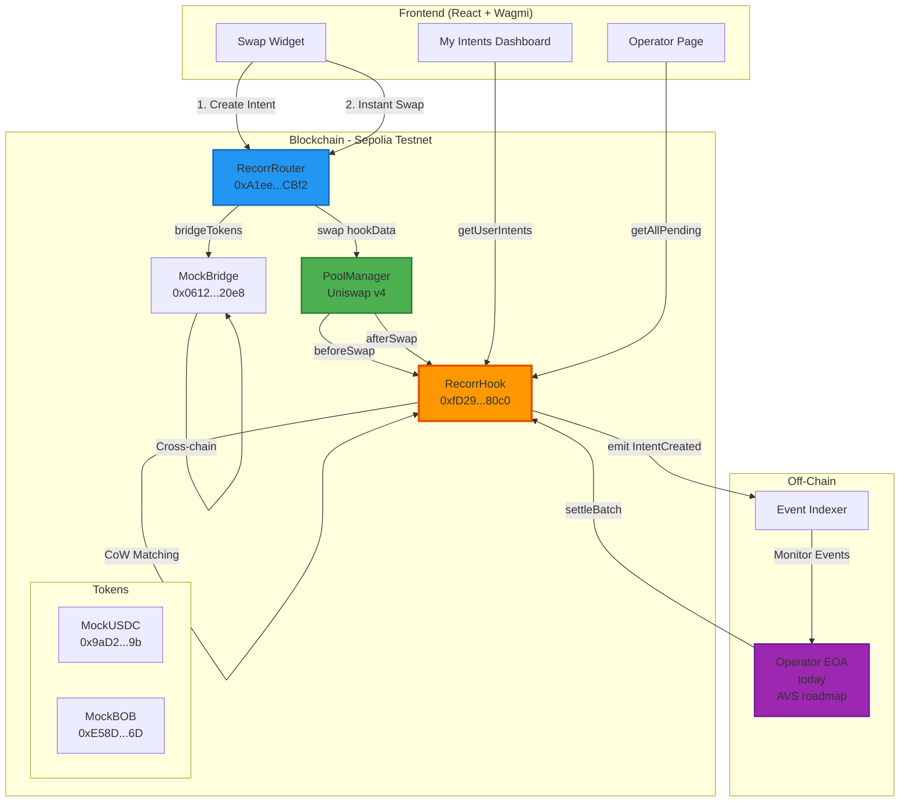

---

## 2. Instant Swap Flow (Sync Mode)

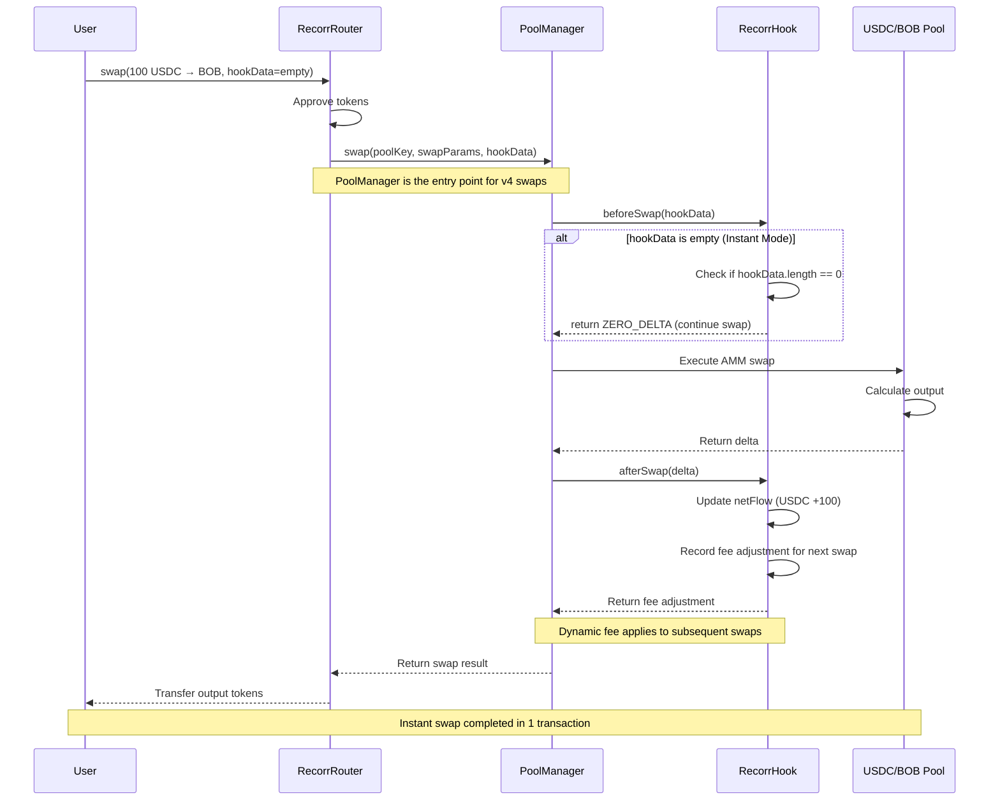

---

## 3. Async Intent + CoW Matching Flow

### PoC Implementation (Current)

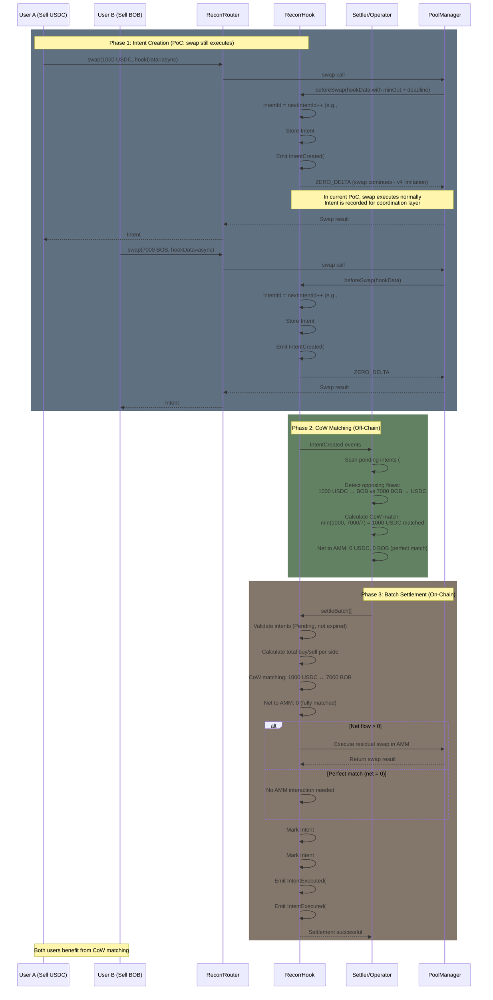

### Production Design (Roadmap)

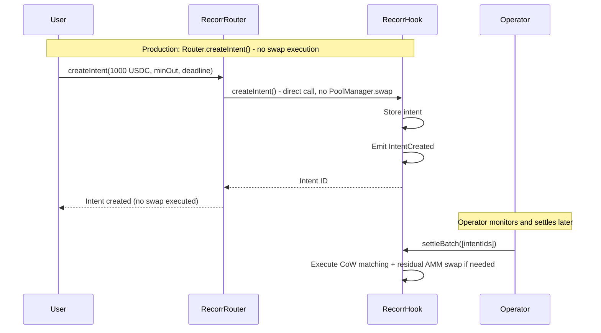

---

## 4. CoW Visual - AMM vs CoW Comparison

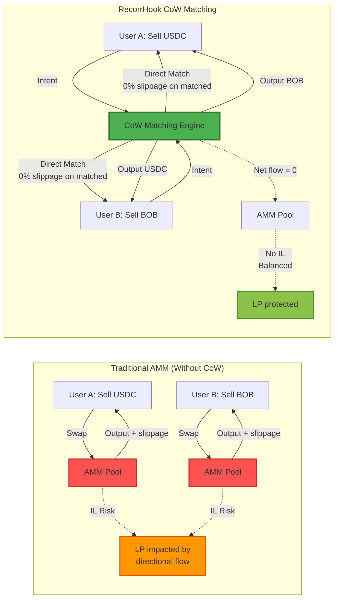

---

## 5. Dynamic Fee Mechanism

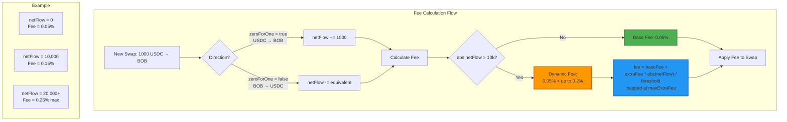

**Formula:**
```
extraFee = min(maxExtraFee, (abs(netFlow) * maxExtraFee) / netFlowThreshold)
finalFee = baseFee + extraFee

Where:
- baseFee = 500 (0.05%)
- maxExtraFee = 2000 (0.2%)
- netFlowThreshold = 10,000 tokens
- Max total fee = 2500 (0.25%)
```

---

## 6. Cross-Chain Flow (Future Enhancement)

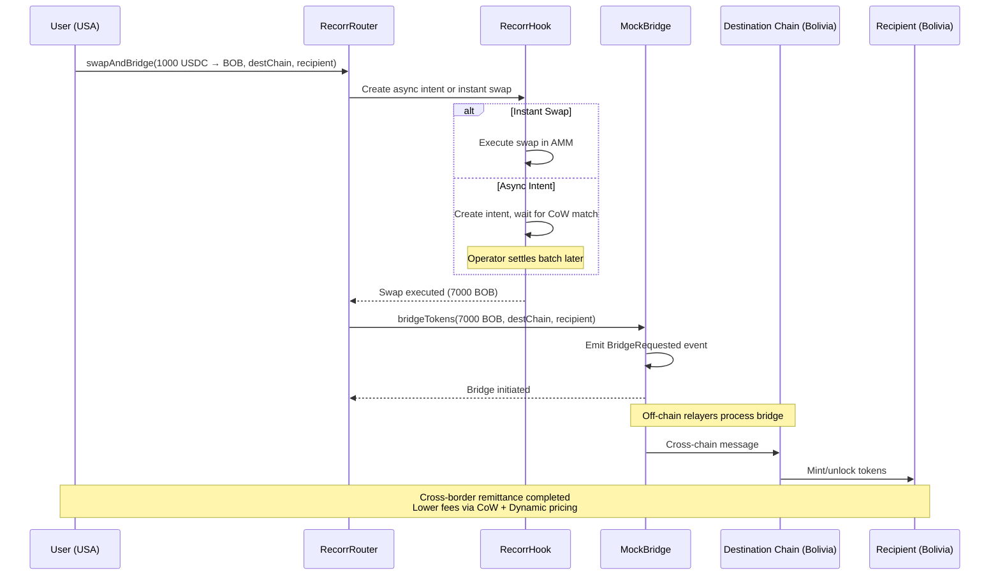

---

## 7. Use Cases Diagram

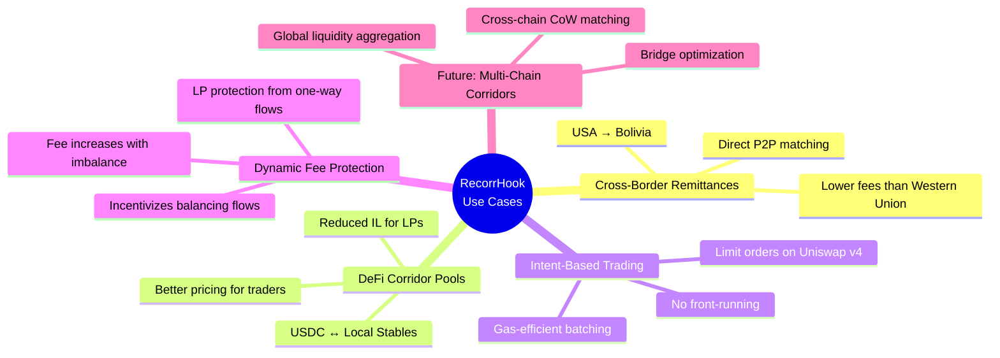

---

## 8. Security & Access Control

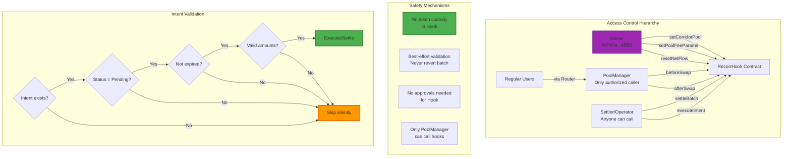

---

## 9. Performance Metrics

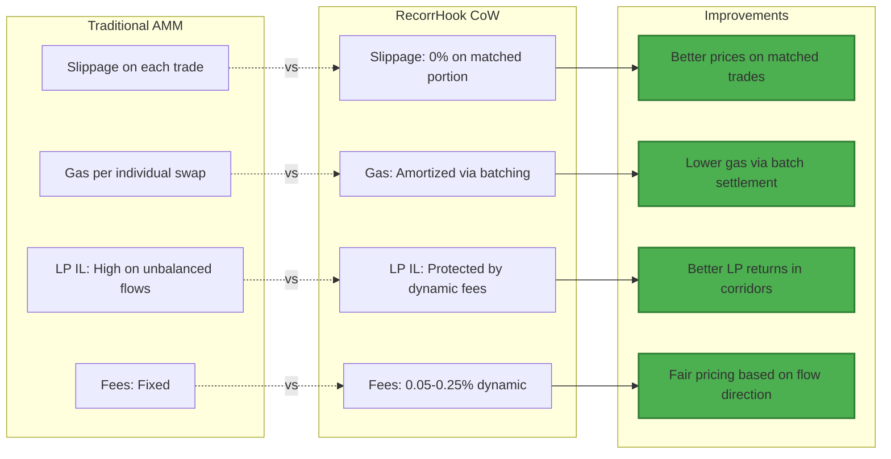

---

## 10. Testing Coverage

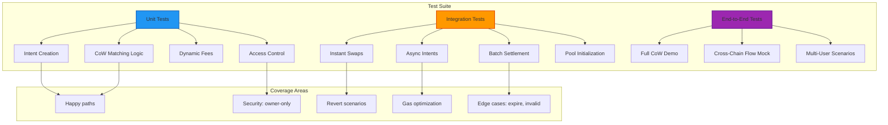

---

## 11. Deployment Architecture

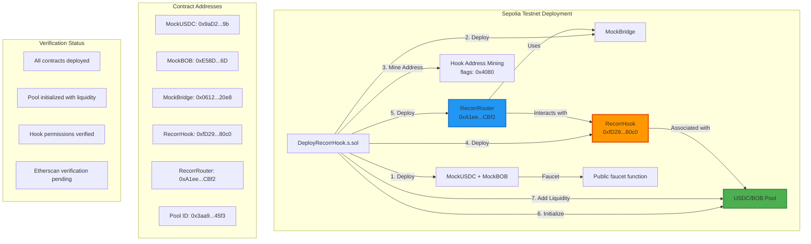

---

## Notes

- These diagrams are optimized for the Hookathon submission and pitch deck

---

*Generated for RecorrHook Hookathon Submission - December 11, 2025*
